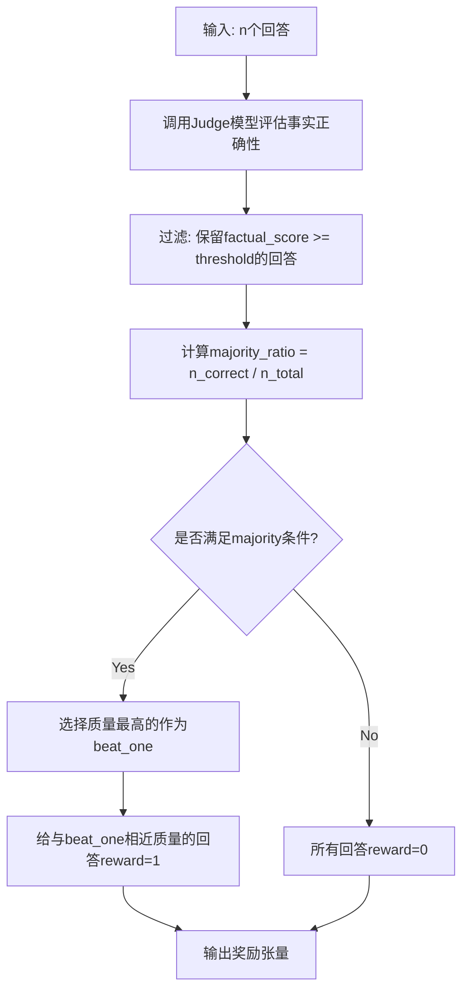

# Painting Majority Reward Manager 使用指南

## 概述

`PaintingMajorityRewardManager` 是专为绘画作品描述（Caption）和问答（QA）任务设计的奖励管理器，实现了分层评判策略，结合事实正确性过滤和质量评估。

## 核心设计理念

### 分层评判策略
1. **第一层：事实正确性过滤** - 使用judge模型基于meta信息（作者、作品、时期）过滤明显事实错误
2. **第二层：质量评估** - 在事实正确的回答中进行质量排序
3. **第三层：Majority逻辑** - 保持原框架的"有争议但倾向正确"训练哲学

### 适配原有Majority逻辑
- **原逻辑**: `1 < majority_num < n` (有争议但大多数正确)
- **新逻辑**: `min_ratio < factual_correct_ratio < max_ratio` (有争议但倾向事实正确)

## 使用步骤

### 1. 数据准备

数据格式要求：
```python
{
    "uid": "painting_001_caption",  # 相同图片/问题的唯一标识
    "prompt": "请描述这幅画作的内容", 
    "image_path": "path/to/painting.jpg",
    "meta_info": {
        "author": "梵高",
        "artwork": "星夜",
        "period": "后印象派时期"
    },
    "data_source": "painting_caption"  # 或 "painting_qa"
}
```

### 2. Judge模型API部署

确保你的judge模型API服务正在运行，支持OpenAI格式的接口：
```bash
# 示例：使用vLLM部署judge模型
python -m vllm.entrypoints.openai.api_server \
    --model path/to/judge/model \
    --port 8000
```

### 3. 配置文件

```yaml
reward_manager:
  reward_manager_type: "painting_majority"
  judge_api_url: "http://localhost:8000/v1/chat/completions"
  judge_model_name: "your-judge-model"
  quality_threshold: 0.7
  min_majority_ratio: 0.3
  max_majority_ratio: 0.8
```

### 4. 训练代码

```python
from verl.workers.reward_manager import get_reward_manager_cls

# 创建reward manager
reward_manager_cls = get_reward_manager_cls("painting_majority")
reward_manager = reward_manager_cls(
    tokenizer=tokenizer,
    num_examine=5,
    judge_api_url="http://localhost:8000/v1/chat/completions",
    judge_model_name="your-judge-model",
    quality_threshold=0.7,
    min_majority_ratio=0.3,
    max_majority_ratio=0.8
)

# 在训练循环中使用
rewards = reward_manager(data_proto)
```

## 参数说明

### 关键参数
- `quality_threshold`: 事实正确性最低阈值 (默认0.7)
- `min_majority_ratio`: 最小majority比例 (默认0.3，对应原来的1<majority_num)
- `max_majority_ratio`: 最大majority比例 (默认0.8，对应原来的majority_num<n)
- `judge_api_url`: Judge模型API地址
- `judge_model_name`: Judge模型名称

### 调优建议
- **quality_threshold**: 根据judge模型的评分分布调整，建议0.6-0.8
- **min/max_majority_ratio**: 根据训练数据的质量分布调整
  - 高质量数据集：可以提高min_ratio (如0.4)
  - 低质量数据集：可以降低min_ratio (如0.2)

## 评判流程



## 支持的数据源

- `painting_caption`: 绘画作品描述任务
- `painting_qa`: 绘画作品问答任务

## 扩展性

框架设计支持轻松扩展：
- 添加新的评判维度（如艺术性、完整性等）
- 支持不同的聚类算法
- 集成更多judge模型

## 故障排除

### 常见问题

1. **Judge模型API调用失败**
   - 检查API地址和模型名称
   - 确认API服务正常运行
   - 检查网络连接

2. **所有回答都获得reward=0**
   - 检查quality_threshold是否过高
   - 检查majority_ratio范围是否合理
   - 查看judge模型的评分分布

3. **评分结果不稳定**
   - 降低judge模型的temperature
   - 增加API调用的重试机制
   - 考虑使用多个judge模型的平均分

### 调试技巧

启用详细日志：
```python
import logging
logging.getLogger("verl.workers.reward_manager.painting_majority").setLevel(logging.DEBUG)
```

查看中间结果：
```python
# 在reward manager中添加调试输出
print(f"Factual correct: {n_factual_correct}/{n_total}")
print(f"Majority ratio: {majority_ratio}")
print(f"Should give reward: {should_give_reward}")
``` 